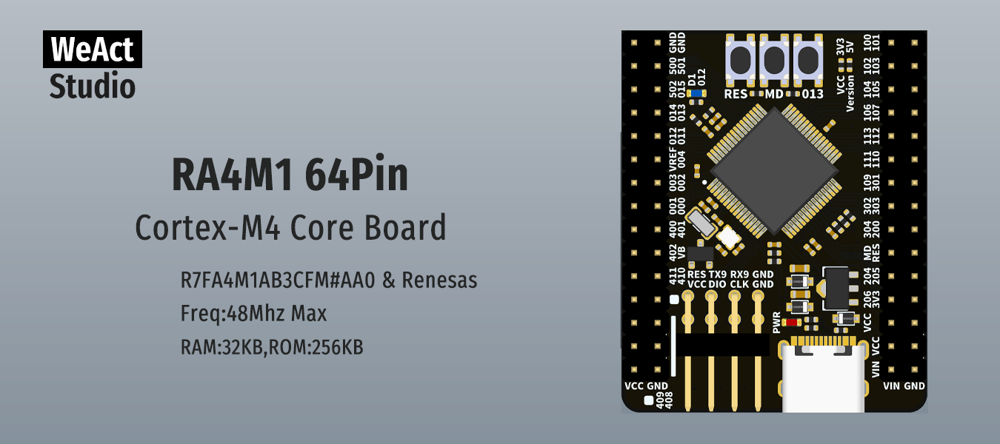

* [English version](./README.md)
# WeActStudio.RA4M1_64Pin_CoreBoard

**R7FA4M1AB3CFM#AA0**  
Cortex-M4  
Freq:48Mhz Max  
RAM:32KB,ROM:256KB     


瑞萨官方网站 www.renesas.cn  

核心板有两个版本:  
3.3V I/O, VCC=3.3V  
5V I/O, VCC=5V  

|目录名称|内容|
| :--:|:--:|
|Doc| 数据手册/参考手册|
|Hardware| 硬件开发资料|
|Examples|软件例程|

## Renesas Flash Programmer 瑞萨程序烧录工具
https://www.renesas.cn/cn/zh/software-tool/renesas-flash-programmer-programming-gui  


```
/*---------------------------------------
- WeAct Studio Official Link
- taobao: weactstudio.taobao.com
- aliexpress: weactstudio.aliexpress.com
- github: github.com/WeActStudio
- gitee: gitee.com/WeAct-TC
- blog: www.weact-tc.cn
---------------------------------------*/
```